# Data Standard for CODEX

**Date**: 2024-08-27

**Author**: Huaying Qiu, Wenrui Wu

---

## Summary

https://docs.google.com/presentation/d/1SGYQYQVoF5bTaQQvSDHbHqKvMe323egWCAPb7hHg9GY/edit#slide=id.g2f5dedbe25e_0_5

Collect everything of one TMA into one folder: 

- Folder: `path/to/folder/[name]`
    - Image: `[name].qptiff`
    - Marker list: `[name]_MarkerList.txt`
    - Core metadata: `[name]_metadata.csv`
    - TMA dearray information: `[name]_dearrayer_d=[diameter].txt`

```
# Demo folder structure

/mnt/nfs/home/wenruiwu/projects/Sarcoma/data_raw/20240611_LMS-TMA_Scan1
├── 20240611_LMS-TMA_Scan1_dearrayer_d=1.3.txt
├── 20240611_LMS-TMA_Scan1_MarkerList.txt
├── 20240611_LMS-TMA_Scan1_metadata.csv
└── 20240611_LMS-TMA_Scan1.qptiff
```

## 0. Check Your Folder

Use the provided script to validate your folder. If no output is generated, it means your folder is valid. If any files are missing, the script will print the missing files.

```sh
## input your folder ^ #####
input_folder=/mnt/nfs/home/wenruiwu/projects/Sarcoma/data_raw/20240611_LMS-TMA_Scan1/
## input your folder $ #####

name=$(basename $input_folder); file_patterns=(${name}.qptiff ${name}_MarkerList.txt ${name}_metadata.csv ${name}_dearrayer_d=*.txt); for pattern in "${file_patterns[@]}"; do find ${input_folder}/${pattern} -print -quit > /dev/null; done
```


## 2. Marker List

Normally located at `/path/to/.temp/MarkerList.txt`. 


## 3. Core Metadata

Some formulae you may want to copy: 

```google sheet
=ArrayFormula(FLATTEN(A2:A10&"|"&B1:H1&"|"&B2:H10))
=CONCATENATE(J2,"-", K2)
```


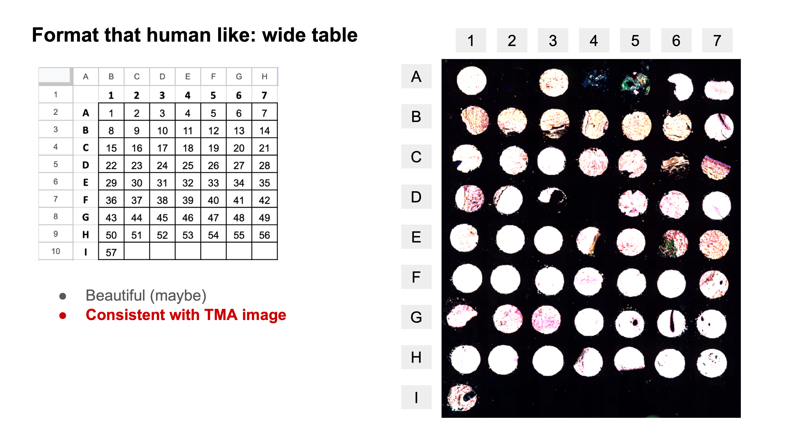
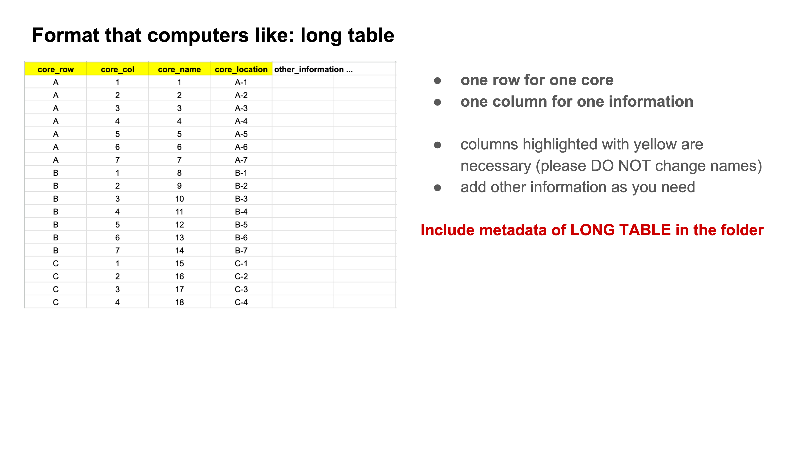
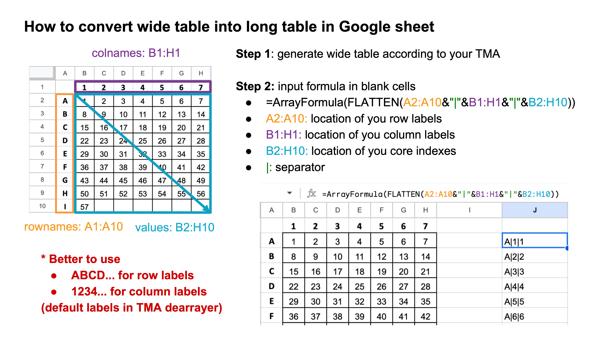
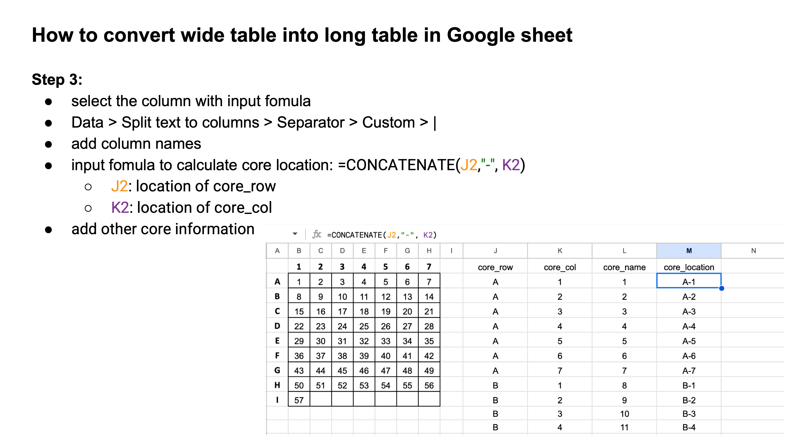
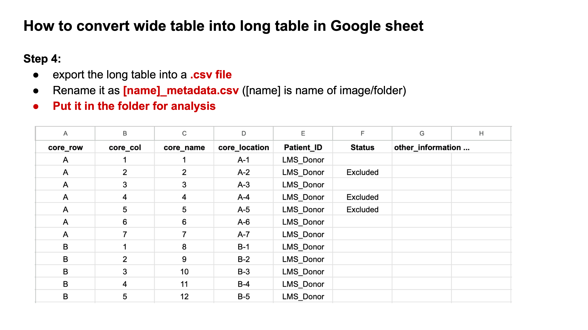


## 4. TMA Dearray Information


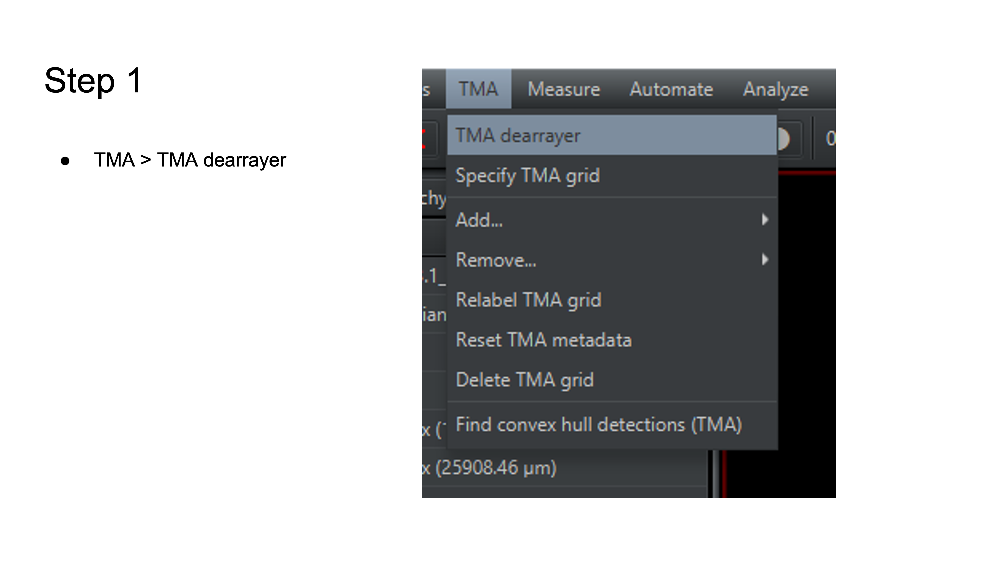
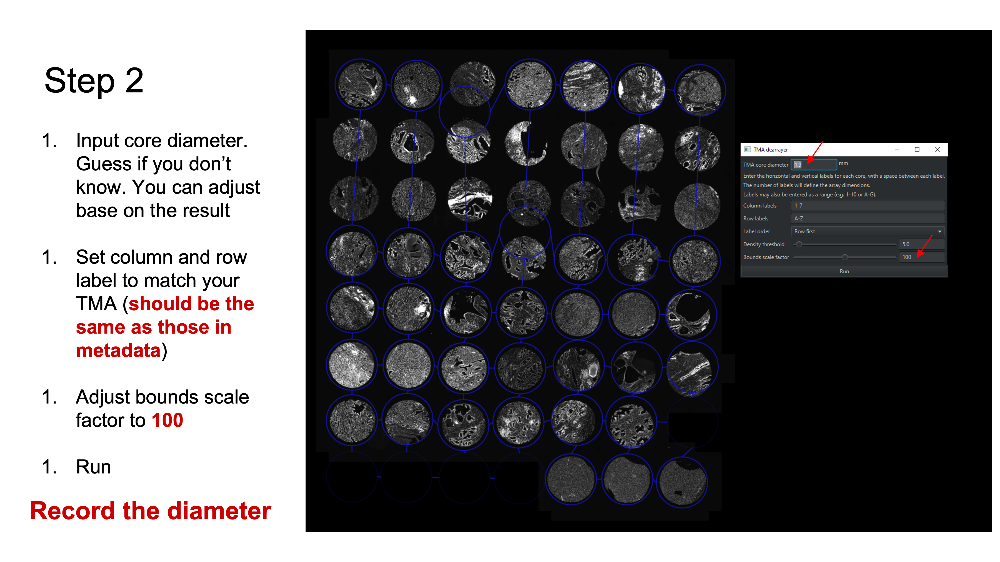
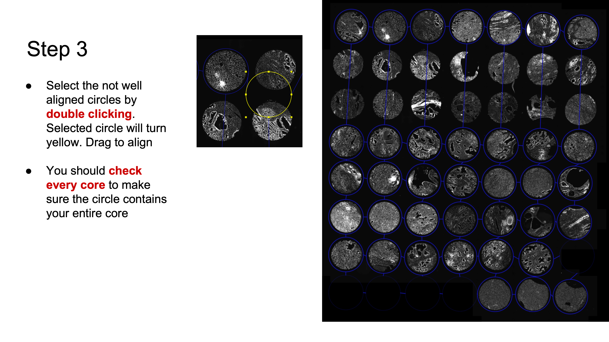
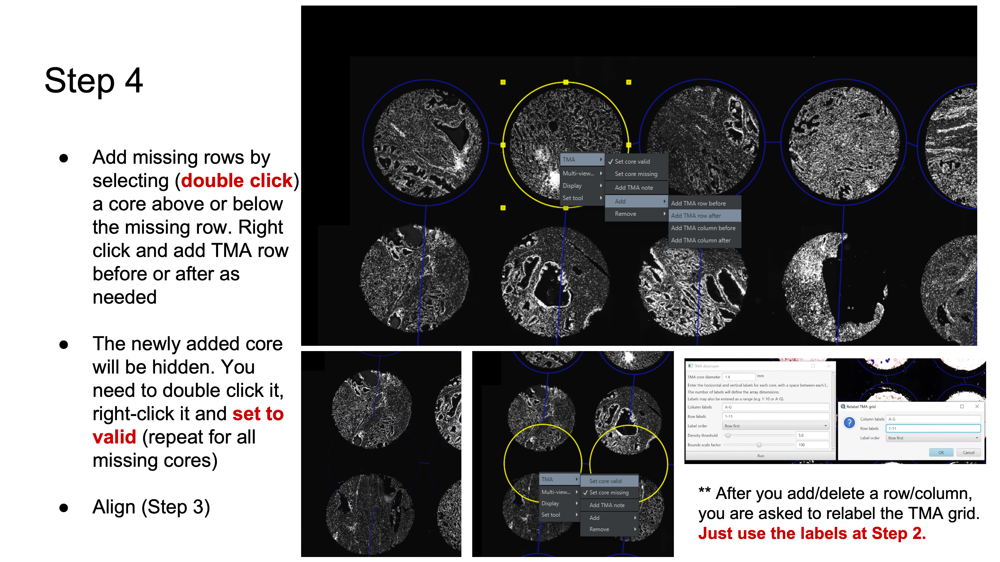
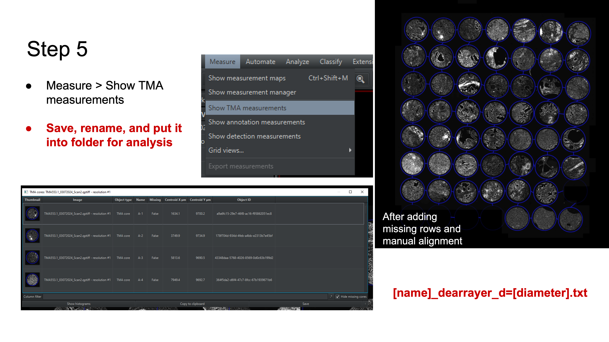
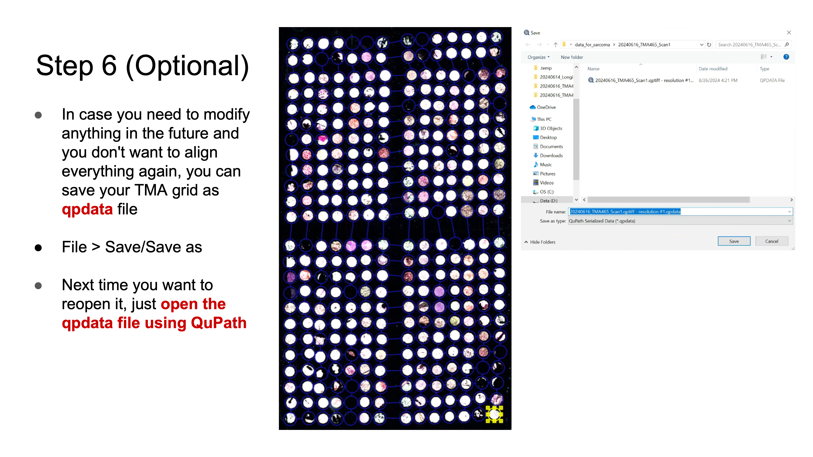
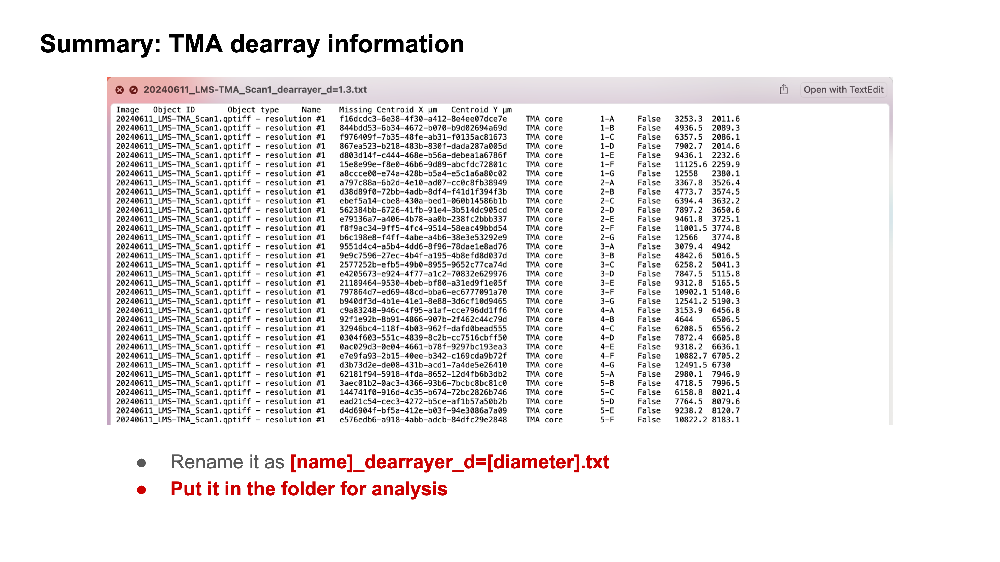