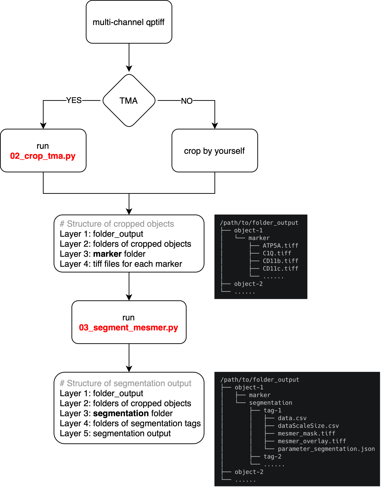

# CODEX Segmentation

## Summary



## Segmentation for TMA

1. Download the `Tutorials/CODEX/01_segmentation` folder from github. 
2. Organize your data following data standard of CODEX `Tutorials/CODEX/00_data_standard`.
3. Use `01_segmentation_test.ipynb` to test your parameter for segmentation.
4. Modify the your parameter JSON file according to your segmentation test result.
5. Modify the path of (1) parameter JSON file and (2) tag for segmentation in `00_segmentation_tma.sh`.
6. Run `00_segmentation_tma.sh`.

## Segmentation for non-TMA
1. Step 1 to 5 in pipeline of "Segmentation for TMA". 
2. Crop your image into multiple objects by yourself and organize them as following: 
```
/path/to/folder_output/[name]
├── object-1
│   └── marker
│       ├── ATP5A.tiff
│       ├── C1Q.tiff
│       ├── CD11b.tiff
│       ├── CD11c.tiff
│       └── ......
├── object-2
│   └── marker
│       ├── ATP5A.tiff
│       ├── C1Q.tiff
│       ├── CD11b.tiff
│       ├── CD11c.tiff
│       └── ......
└── ......
```
3. Run `python /path/to/03_segment_mesmer.py <path_parameter> <tag>`. 


## Graph
```
# File structure of folder_input
/path/to/folder_input/[name]
├── [name].qptiff
├── [name]_MarkerList.txt
├── [name]_dearrayer.txt
├── [name]_metadata.csv
└── [name]_parameter.json


# Parameter JSON file
{
    "name": "20240611_LMS-TMA_Scan1", 
    "dir_input": "/mnt/nfs/home/wenruiwu/projects/Sarcoma/data_test/data_input/",
    "dir_output": "/mnt/nfs/home/wenruiwu/projects/Sarcoma/data_test/data_output/", 

    "diameter_mm": 1.3,
    
    "boundary": ["GLUT1", "NaKATP", "β-catenin", "CD45", "HLA1-300", "CD68", "CD11c", "Podoplanin", "CD15", "CD8", "panCK", "CD31", "CD206", "CD163"], 
    "internal": ["DAPI", "α-SMA", "Desmin", "Vimentin"], 
    "scale": true, 
    "pixel_size_um": 0.5068,
    "maxima_threshold": 0.075, 
    "interior_threshold": 0.20
}

# File structure of folder_output
/path/to/folder_output/[name]
├── object-1
│   ├── marker
│   │   ├── ATP5A.tiff
│   │   ├── C1Q.tiff
│   │   ├── CD11b.tiff
│   │   ├── CD11c.tiff
│   │   └── ......
│   └── segmentation
│       ├── tag-1
│       │   ├── data.csv
│       │   ├── dataScaleSize.csv
│       │   ├── mesmer_mask.tiff
│       │   ├── mesmer_overlay.tiff
│       │   └── parameter_segmentation.json
│       ├── tag-2
│       └── ......
├── object-2
└── ......
```