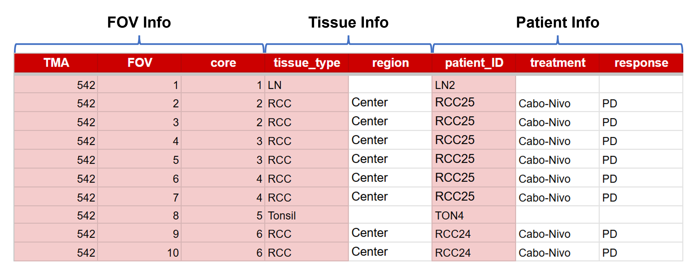

# Data Standard for CosMx

1. AtoMx output files
2. Metadata for FOV
3. H&E and CosMx images


## 0. Nomenclature

Slide name format: `[project name]_TMA[TMA number]_section[section number]_v[AtoMx version]`

- `project name`:  Project abbreviation or full name.  
- `TMA number`: TMA number. 
- `section number`: Two-digit section number, with leading zero if needed (e.g., 01, 02).
- `AtoMx version`: AtoMx version without periods (e.g., v132 for v1.3.2).

```sh
## create folder for CosMx data
slide_name=RCC_TMA542_section05_v132
mkdir /mnt/nfs/storage/CosMX/$slide_name
mkdir /mnt/nfs/storage/CosMX/$slide_name/AtoMx
mkdir /mnt/nfs/storage/CosMX/$slide_name/metadata
mkdir /mnt/nfs/storage/CosMX/$slide_name/image
```

### File structure

```
/mnt/nfs/storage/CosMX/RCC_TMA542_section05_v132/
├── AtoMx
├── metadata
└── image
```


## 1. AtoMx output files

The files exported from AtoMx SIP. 

### File structure

```
/mnt/nfs/storage/CosMX/RCC_TMA542_section05_v132/
├── + AtoMx
│   ├── flatFiles
│   ├── RawFiles
│   ├── seuratObject_*.RDS
│   └── TileDB
├── metadata
└── image
```


## 2. Metadata for FOV

File name format for metadata: `metadata_[slide name].csv`

The meta data should contain at least the following information:

- FOV info: `TMA`, `core`, and `FOV` for TMA, core, and FOV number respectively. 
- Tissue info: `tissue_type` for tissue type. 
- Patient info: `patient_ID` for patient ID. 

### Notice

- One row for each FOV.
- Leave missing values as empty. DO NOT replace them with "NA".
- `patient_ID` and `tissue_type` are necessary for batch effect correction at the tissue level. Therefore, 
  - No missing value is allowed. 
  - Combination of `patient_ID` and `tissue_type` should be unique for different tissue sources. 

### DEMO


\# Columns with pink background are necessary. 

### File structure

```
/mnt/nfs/storage/CosMX/RCC_TMA542_section05_v132/
├── AtoMx
├── + metadata
│   └── metadata_RCC_TMA542_section05_v132.csv
└── image
```


## 3. H&E and CosMx images

File name format for images: `HE_[slide name].svs` and `CosMx_[slide name].tiff`

### Notice

- Other image formats are acceptable. The `.svs` and `.tiff` is just the default output formats for H&E scanner and AtoMx respectively. 
- The CosMx and H&E images should be generated from the same slide.

### File structure

```
/mnt/nfs/storage/CosMX/RCC_TMA542_section05_v132/
├── AtoMx
├── metadata
└── + image
    ├── HE_RCC_TMA542_section05_v132.svs
    └── CosMx_RCC_TMA542_section05_v132.tiff
```


## Summary

```
/mnt/nfs/storage/CosMX/RCC_TMA542_section05_v132/
├── AtoMx
│   ├── flatFiles
│   ├── RawFiles
│   ├── seuratObject_*.RDS
│   └── TileDB
├── metadata
│   └── metadata_RCC_TMA542_section05_v132.csv
└── image
    ├── HE_RCC_TMA542_section05_v132.svs
    └── CosMx_RCC_TMA542_section05_v132.tiff
```
